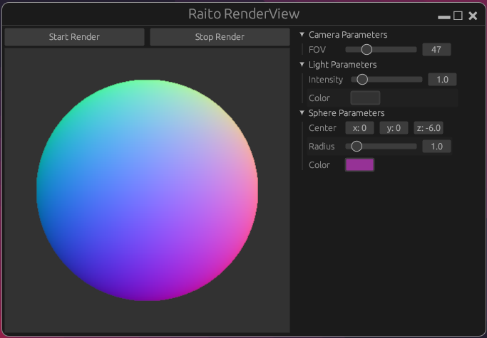

# Raito
Raito Rendering engine

  
  <i>Raito RenderView UI with a sphere shaded with normals</i>

## Dependencies

- The GUI is created with [egui](https://github.com/emilk/egui) and [eframe](https://github.com/emilk/egui/tree/master/crates/eframe)
- The project uses [clap](https://github.com/clap-rs/clap) for command line parsing
- The documentation runs on mkdocs with several plugins required :
  - `pip install mkdocs-material` (theme)
  - `pip install mkdocs-glightbox` (to zoom on images)

## Run

1. [Install rust](https://www.rust-lang.org/tools/install)
2. You might need to install specific packages for eframe :
  - Linux : `sudo apt-get install libxcb-render0-dev libxcb-shape0-dev libxcb-xfixes0-dev libxkbcommon-dev libssl-dev`
  - Fedora : `sudo dnf install clang clang-devel clang-tools-extra libxkbcommon-devel pkg-config openssl-devel libxcb-devel gtk3-devel atk fontconfig-devel`
3. Build and run : `cargo run --release`
4. To build and run doc launch : `python -m mkdocs serve`. That will serve the site on localhost
