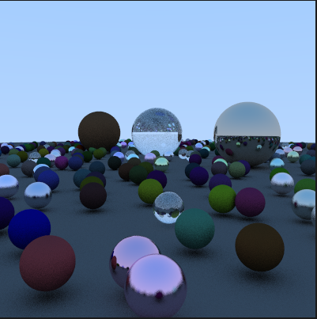

# Introduction

<figure markdown="span">
  
  <figcaption>A render done with Raito</figcaption>
</figure>

## Why another rendering engine ?

Raito is a rendering engine created to explore and discover how rendering works.

It was concieved after months of working on Arnold shaders and consistently thinking that I'm discovering new things only when I need them, which also means that I always had a
partial understanding of how the render engine was working.

By creating my own rendering engine, I hope to encounter lots of diverse issues,
and to deduce the technicalities of a rendering engine and algorithms under the hood.

Also, I dropped Rust after the engineering school, so I wanted to get back to it and
(re)discover this incredible programming language.

## Description

<figure class="video_container">
  <video controls="true" allowfullscreen="true">
    <source src="videos/pres-1.webm" type="video/webm">
  </video>
  <figcaption>Raito interface and rendering examples</figcaption>
</figure>

!!! note

    For now there is not much implemented as this is the start of the project

The goal for a final product is to have :

- the rendering engine to launch in command line arguments and that will take a scene in input and output an image
- A render view that enables us to use IPR (Interactive Photorealistic Rendering)
- Widgets that enables the user to edit the current scene (move lights, etc)

## Roadmap

!!! note
    
    The roadmap is not compelted yet. For now we only have first 2 pre-releases of the project.

**Release 0.0.0**

- [x] Simple UI to setup some geometry
- [ ] intersections 
    - [x] with spheres
    - [ ] with triangles
- [x] Simple ray tracing
    - [x] Tracing one ray and checking for hit
    - [x] Propagate ray tracing information onwards and backwards once we get a response from a light or we reached the end
- [ ] Be able to export the image
- [x] simple light model
    - [x] sky
    - [x] point lights
- [x] Light transport with shading information, simple shading models
    - [x] diffuse
    - [x] metal
    - [x] glass
- [x] Be able to move the camera (camera & world space, for now no model space). Not interactive (move the camera from the parameters tab)
- [x] Simple IPR (interactive progressive rendering)
    - [x] either we launch the render or we launch the IPR (and then we can stop it)
    - [x] Modifying parameters relaunches the render on IPR mode.
- [x] Be able to load scenes from XML files.
- [ ] Add multi-threading & buckets : each available thread takes an available bucket, renders it, sends the result to the main thread that processes it and update the final image
- [ ] Progressive rendering
- [ ] Move the camera with keyboard/mouse events

**Release 0.1.0**

- [ ] BVH ...
- [ ] Cleaner code, more errors handling
- [ ] Plugin system for materials and shapes
- [ ] Rework XML loading to work dynamically
- [ ] UVs, Texture loading on materials
- [ ] ...
