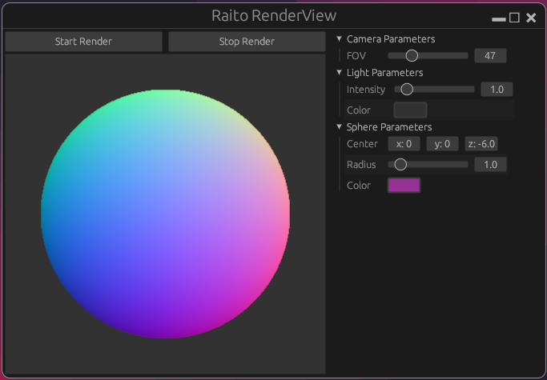

# Introduction

## Why another rendering engine ?

Raito is a rendering engine created to explore and discover how rendering works.

It was concieved after months of working on Arnold shaders and consistently thinking that I'm discovering new things only when I need them, which also means that I always had a
partial understanding of how the render engine was working.

By creating my own rendering engine, I hope to encounter lots of diverse issues,
and to deduce the technicalities of a rendering engine and algorithms under the hood.

Also, I dropped Rust after the engineering school, so I wanted to get back to it and
(re)discover this incredible programming language.

## Description

!!! note

    For now there is not much implemented as this is the start of the project

The goal for a final product is to have :

- the rendering engine to launch in command line arguments and that will take a scene in input and output an image
- A render view that enables us to use IPR (Interactive Photorealistic Rendering)
- Widgets that enables the user to edit the current scene (move lights, etc)

<figure markdown="span">
  
  <figcaption>This is the Raito RenderView</figcaption>
</figure>

## Roadmap

!!! note
    
    The roadmap is not compelted yet. For now we only have first 2 pre-releases of the project.

**Release 0.0.0**

- [x] Simple UI to setup some geometry
- [ ] intersections 
    - [x] with spheres
    - [ ] with triangles
- [ ] Simple ray tracing
    - [x] Tracing one ray and checking for hit
    - [x] Propagate ray tracing information onwards and backwards once we get a response from a light or we reached the end
- [ ] simple light model
    - [ ] skydome
    - [x] point lights
- [ ] Light transport with shading information, simple shading models
    - [x] reflective
    - [ ] diffuse
    - [ ] glass
- [ ] Be able to move the camera (camera & world space, for now no model space). Not interactive (move the camera from the parameters tab)

**Release 0.1.0**

- [ ] Add multi-threading & buckets : each available thread takes an available bucket, renders it, sends the result to the main thread that processes it and update the final image
- [ ] Implement AA : relaunch render for each bucket (value can be set from the interface)
- [ ] Work on IPR
    - [ ] either we launch the render or we launch the IPR (and then we can stop it)
    - [ ] Modifying parameters relaunches the IPR
- [ ] Plug-in system for materials
- [ ] Maybe implement UVs, provide these infos to the materials so that we can start using textures, etc
